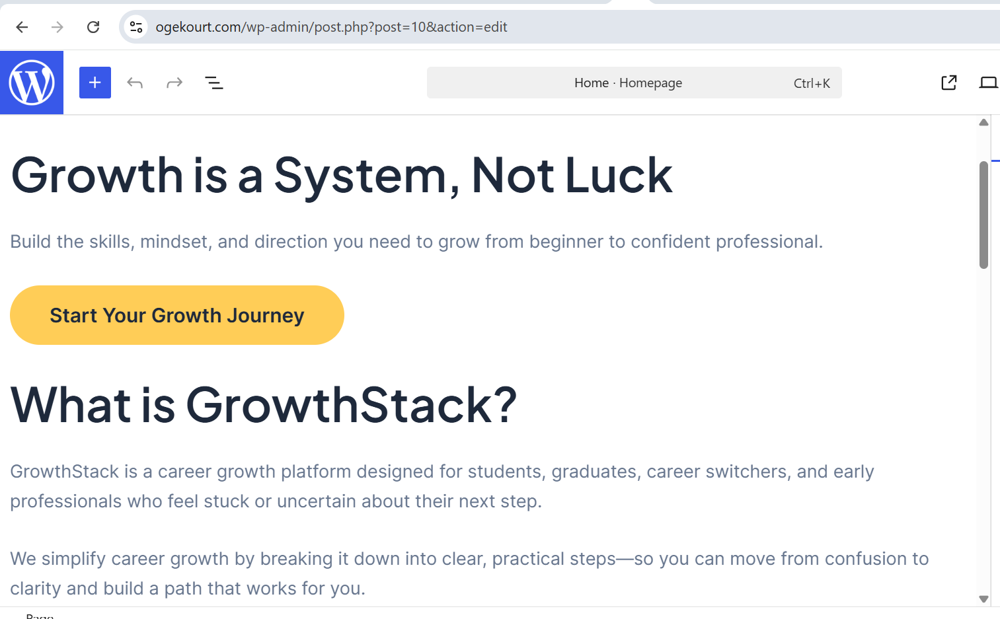
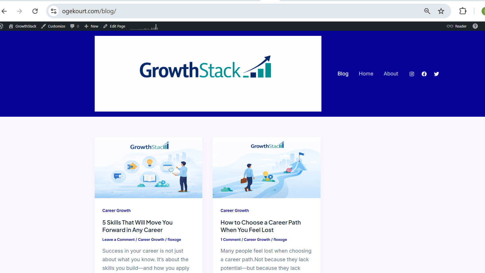
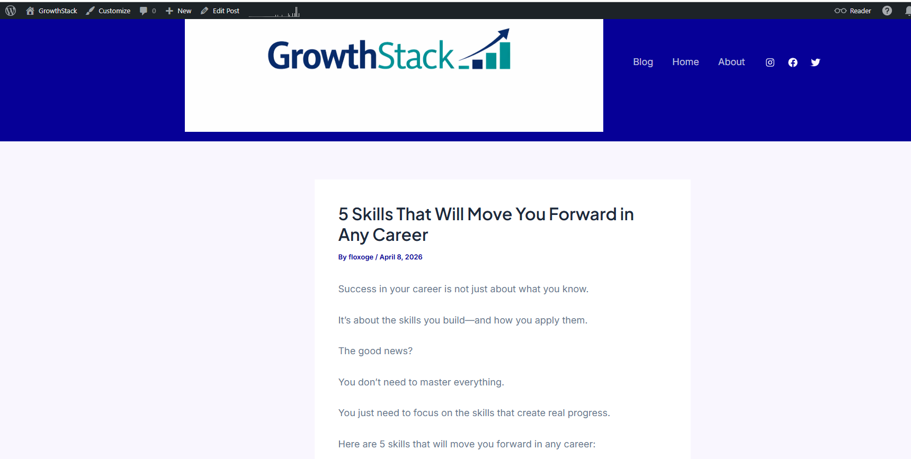

# GrowthStack — Career Growth Platform

GrowthStack is a career development platform designed to help students, career switchers, and early professionals move from uncertainty to clarity and grow into confident professionals.

It is built on a simple idea:

> Growth is a system, not luck.

---

## 🌐 Live Website

https://ogekourt.com

---

## 🎯 Problem

Many individuals struggle with career direction due to:
- Lack of clarity
- Limited structured guidance
- Uncertainty about what skills matter

This often leads to stagnation, confusion, and slow career progression.

---

## 💡 Solution

GrowthStack provides a structured approach to career development through:
- Practical, easy-to-understand content
- Clear frameworks for career growth
- Actionable guidance based on real-world experience

The platform simplifies complex career decisions and helps users take meaningful steps forward.

---

## 🚀 Features

- 📚 Blog-based knowledge platform
- 🧭 Career path guidance
- 🧠 Skill development insights
- 📈 Growth-focused frameworks
- 💬 Comment-enabled engagement

---

## 🧱 Tech Stack

- WordPress (Content Management System)
- Astra Theme (UI/UX Design)
- Canva (Branding & Visual Assets)

---

## 🖼️ Screenshots

### Homepage

### Blog Page

### Sample Post

---

## 🔮 Future Improvements

- User accounts and personalised career paths
- Interactive tools (e.g., career path builder)
- Data-driven insights and recommendations
- Integration with learning and job platforms

---

## 👤 Author

Built by Oge  
Data Science | Operations | Product Thinking  

GrowthStack reflects a combination of analytical thinking, real-world experience, and a passion for helping others grow.

---

## 📌 Project Purpose

This project demonstrates:
- Product thinking and execution
- Ability to translate ideas into real solutions
- Structured content design
- User-focused problem solving

---

## ⭐ Final Note

Growth is not about perfect conditions.

It’s about taking action, learning, and improving consistently.
